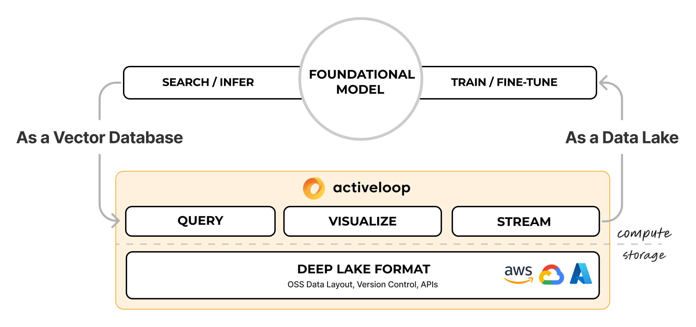

# 🏠 Deep Lake Docs

## Activeloop Deep Lake

### Use Cases for Deep Lake

#### Deep Lake as a Data Lake For Deep Learning

* Store and organize unstructured data (images, audios, nifti, videos, text, metadata, and more) in a versioned data format optimized for Deep Learning performance.
* Rapidly query and visualize your data in order to create optimal training sets.
* Stream training data from your cloud to multiple GPUs, without any copying or bottlenecks.

#### Deep Lake as a Vector Store for RAG Applications

* Store and search embeddings and their metadata including text, jsons, images, audio, video, and more. Save the data locally, in your cloud, or on Deep Lake storage.
* Build Retrieval Augmented Generation (RAG) Apps using our integrations with [LangChain](examples/rag/langchain-integration.md) and [LlamaIndex](examples/rag/llamaindex-integration.md)
* Run computations locally or on our [Managed Tensor Database](examples/rag/managed-database/)

<figure><figcaption>
Deep Lake Architecture for Inference and Model Development Applications.
</figcaption></figure>

### To start using Deep Lake ASAP, check out our [Deep Learning Quickstart](examples/dl/quickstart.md), [RAG Quickstart](examples/rag/quickstart.md), and [Deep Learning Playbooks](examples/dl/playbooks/).

Please check out Deep Lake's [GitHub repository](https://github.com/activeloopai/Hub) and give us a ⭐ if you like the project. &#x20;

Join our [Slack Community ](https://slack.activeloop.ai)if you need help or have suggestions for improving documentation!

### Deep Lake Docs Overview


[authentication](setup/authentication/)



[quickstart.md](examples/dl/quickstart.md)



[quickstart.md](examples/rag/quickstart.md)



[playbooks](examples/dl/playbooks/)



[tutorials](examples/dl/tutorials/)



[best-practices](technical-details/best-practices/)



[api.md](examples/dl/api.md)


