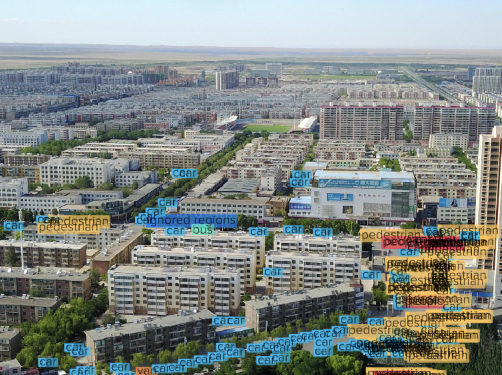
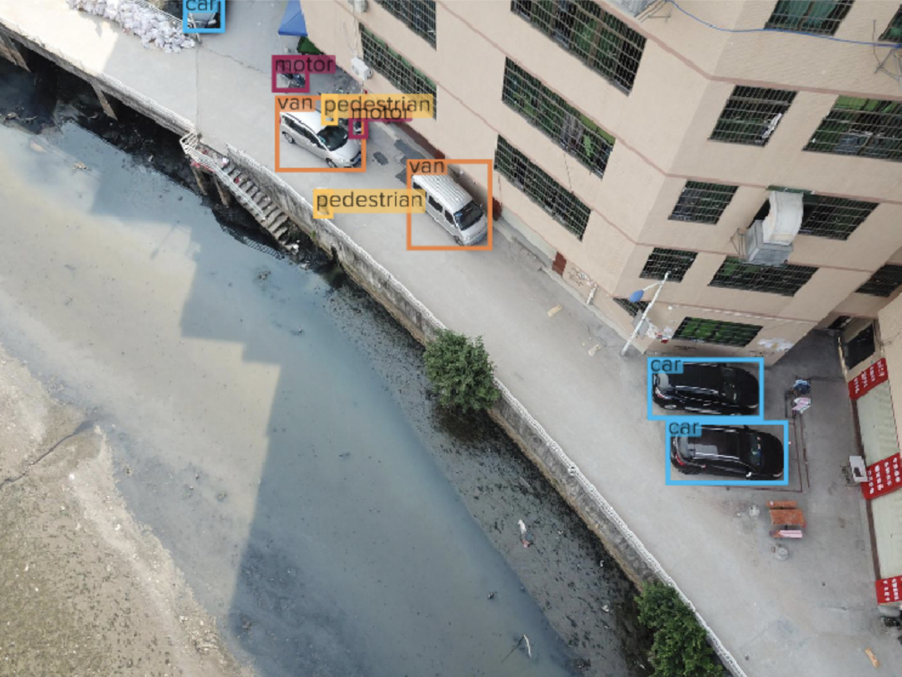
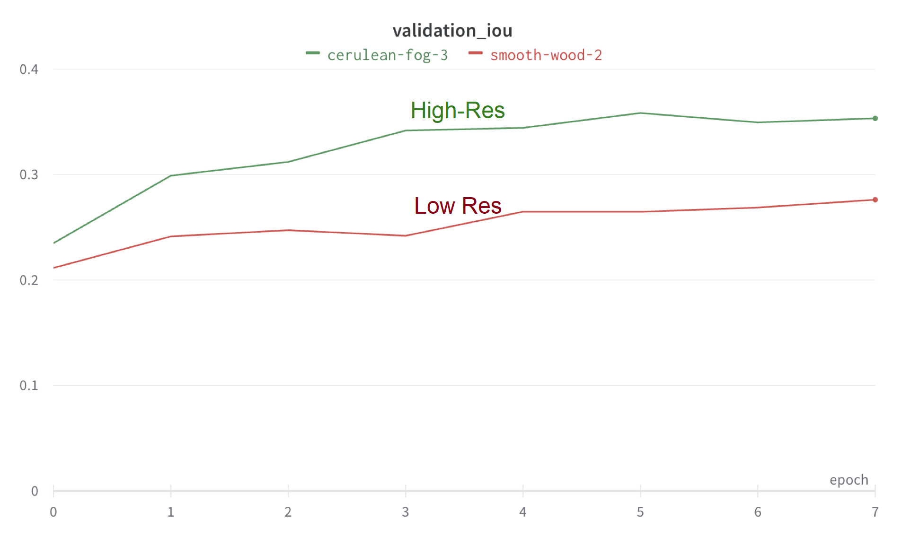
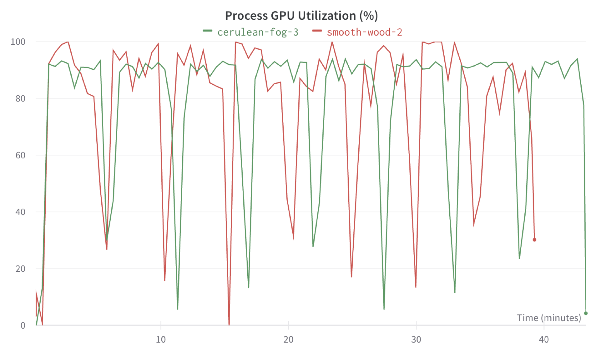

# Training Reproducibility Using Deep Lake and Weights & Biases

### How to achieve full reproducibility of model training by combining Deep Lake data lineage with W\&B logging

Experiment tracking tools such as [Weights & Biases](https://wandb.ai/) (W\&B) improve reproducibility of your machine learning experiments by offering logging of datasets, hyper parameters, source codes, and more. When running model training with W\&B and Deep Lake, Deep Lake automatically pushes information required to reproduce the data such as the `uri`, `commit_id`, and `view_id` to the active W\&B run. By fully logging the state of your dataset, model, and source code, you can achieve full reproducibility of model training run for datasets of any size.

**This playbook demonstrates how to use** [**Activeloop Deep Lake**](https://app.activeloop.ai/) **with** [**Weights & Biases**](https://wandb.ai/) **to:**

* Upload a Deep Lake dataset in a W\&B run and create a W\&B artifact
* Query the dataset using Activeloop and save the query result in optimized format for training
* Train an object detection model on the saved query result and log the training parameters in a W\&B run
* Re-train the model with adjusted parameters and use W\&B to compare the different training runs.

### Prerequisites&#x20;

In addition to installation of commonly used packages in deep-learning, this playbook requires installation of:&#x20;

```
!pip install deeplake
!pip install wandb
!pip install albumentations
```

The required python imports are:

```python
import deeplake
import albumentations as A
from albumentations.pytorch import ToTensorV2
import numpy as np
import torch
import wandb
import time
import sys
import math
import torchvision
from torchvision.models.detection.faster_rcnn import FastRCNNPredictor
```

You should also register with Activeloop and W\&B, create API tokens for both tools, and log in to your W\&B account via the CLI using:

```
!wandb login
```

### Creating a W\&B Artifact from a Deep Lake Dataset

While the most common use case W\&B is to track training and evaluation jobs, you may also wrap your dataset upload jobs in a W\&B run in order to create W\&B artifacts. Any future runs that consume this dataset will also consume the corresponding W\&B artifact. As a result, your Deep Lake datasets will be automatically tracked by W\&B and can be visualized in the W\&B artifacts lineage UI.

Any `commit`, `copy` or `deepcopy` operation inside a W\&B run will create a W\&B artifact. Here we emulate a dataset upload by copying a dataset that is already hosted by Activeloop.

```python
WANDB_PROJECT = 'deeplake-demos'

run = wandb.init(project=WANDB_PROJECT, job_type='dataset_upload')

ds_train = deeplake.deepcopy('hub://activeloop/visdrone-det-train', 'hub://dl-corp/visdrone-det-train',
                 dest_token = 'Insert API Token')

ds_val = deeplake.deepcopy('hub://activeloop/visdrone-det-val', 'hub://dl-corp/visdrone-det-val',
                 dest_token = 'Insert API Token')

run.finish()
```


You may replace `dl-corp` in the dataset path above with your own Deep Lake organization in order to run the code.


If we open the W\&B page for the run above, we see that the datasets has been tracked that artifacts were created for both the training and validation datasets.&#x20;



### Train a model using the Deep Lake dataset

Suppose we are building a surveillance system to count and classify vehicles in small-to-medium size parking lots. The [visdrone dataset](https://app.activeloop.ai/activeloop/visdrone-det-train) is suitable starting point because it contains a variety of images of vehicles taken in cities using a UAV. However, many images are taken from very large viewing distances, thus resulting in small objects that are difficult to detect in object detection models, and are also not relevant to our surveillance application, like the image below.

<figure><figcaption></figcaption></figure>

Therefore, we filter out these images and train the model on a subset of the dataset that is more appropriate for our application.

#### Querying the dataset

Let's use the query engine on the [Deep Lake UI ](https://app.activeloop.ai)to filter out samples that contain any cars with a width or height below 20 pixels. Since most images with vehicles contain cars, this query is a reliable proxy for imaging distance.

```sql
select * where not any(logical_and(logical_or(boxes[:,2]<20, boxes[:,3]<20), labels == 'car'))
```

This query eliminates approximately 50% of the samples in the dataset.



The steps above can also be performed programmatically.

```python
# train_view = ds.query("select * where not any(logical_and(logical_or(boxes[:,2]<20, boxes[:,3]<20), labels == 'car'))")
# train_view.save_view()

# val_view = ds.query("select * where not any(logical_and(logical_or(boxes[:,2]<20, boxes[:,3]<20), labels == 'car'))")
# val_view.save_view()
```

#### Training the model

Before training the model, which will often happen on a different machine than where the dataset was created, we first re-load the data for training and optimize if for streaming performance.

```python
ds_train = deeplake.load('hub://dl-corp/visdrone-det-train', token = 'Insert API Token', read_only = True)

ds_val = deeplake.load('hub://dl-corp/visdrone-det-val', token = 'Insert API Token', read_only = True)
```

```python
ds_train_view = ds_train.load_view('6337166131028ba8bcf7f2ff', optimize = True, num_workers = 4)

ds_val_view = ds_val.load_view('633716a10c1052d4385ab5c8', optimize = True, num_workers = 4)
```

An object detection model can be trained using the same approach that is used for all Deep Lake datasets, with several examples in [our tutorials](https://docs.activeloop.ai/tutorials/training-models).

When using subsets of datasets, it's advised to remap the input classes for model training. In this example, the source dataset has 12 classes, but we are only interested in 9 classes containing objects we want to localize in our parking lot (`bicycle`, `car`, `van`, `truck`, `tricycle`, `awning-tricycle`, `bus`, `motor`, `others`). Therefore, we remap the classes of interest to values 0,1,2,3,4,6,7,8 before feeding them into the model for training.&#x20;

Later in this playbook, we will experiment with different transform resolutions, so we specify the transform resolution (`WIDTH`, `HEIGHT`), `BATCH_SIZE`, and minimum bounding box area for transformation (`MIN_AREA`).&#x20;


All bounding boxes below MIN\_AREA are ignored in the transformation and are not fed to the model


```python
WIDTH = 160
HEIGHT = 128
MIN_AREA = 32
BATCH_SIZE = 16

# These are the classes we care about and they will be remapped to 0,1,2,3,4,5,6,7,8 in the model
CLASSES_OF_INTEREST = ['bicycle', 'car', 'van', 'truck', 'tricycle', 'awning-tricycle', 'bus', 'motor', 'others']

# The classes of interest correspond to the following array values in the current dataset
INDS_OF_INTEREST = [ds_train.labels.info.class_names.index(item) for item in CLASSES_OF_INTEREST]
```

Next, let's specify an augmentation pipeline, which mostly utilizes [Albumentations](https://github.com/albumentations-team/albumentations). We perform the remapping of the class labels inside the transformation function.

```python
# Augmentation pipeline for training using Albumentations
tform_train = A.Compose([
    A.RandomSizedBBoxSafeCrop(width=WIDTH, height=HEIGHT, erosion_rate=0.2),
    A.Rotate(limit=20, p=0.5),
    A.HorizontalFlip(p=0.5),
    A.RandomBrightnessContrast(brightness_limit=0.1, contrast_limit=0.1, p=0.5),
    A.Normalize(mean=(0.485, 0.456, 0.406), std=(0.229, 0.224, 0.225)),
    ToTensorV2()
], bbox_params=A.BboxParams(format='pascal_voc', label_fields=['class_labels', 'bbox_ids'], min_area=MIN_AREA, min_visibility=0.6)) # 'label_fields' and 'box_ids' are all the fields that will be cut when a bounding box is cut.


# Augmentation pipeline for validation using Albumentations
tform_val = A.Compose([
    A.Resize(width=WIDTH, height=HEIGHT),
    A.Normalize(mean=(0.485, 0.456, 0.406), std=(0.229, 0.224, 0.225)),
    ToTensorV2()
], bbox_params=A.BboxParams(format='pascal_voc', label_fields=['class_labels', 'bbox_ids'], min_area=MIN_AREA, min_visibility=0.6)) # 'label_fields' and 'box_ids' are all the fields that will be cut when a bounding box is cut.


# Transformation function for pre-processing the Deep Lake sample before sending it to the model
def transform_train(sample_in):
    # sample_in is a row in the dataset, referenced as a dictionary. 
    # sample_in['images'] is like ds.images[index].numpy()
    
    # Convert any grayscale images to RGB
    image = sample_in['images']
    shape = image.shape 
    if shape[2] == 1:
        image = np.repeat(image, int(3/shape[2]), axis = 2)

    # Convert boxes to Pascal VOC format
    boxes = coco_2_pascal(sample_in['boxes'], shape)
    
    # Filter only the labels that we care about for this training run
    labels_all = sample_in['labels']
    indices = [l for l, label in enumerate(labels_all) if label in INDS_OF_INTEREST]
    labels_filtered = labels_all[indices]
    labels_remapped = [INDS_OF_INTEREST.index(label) for label in labels_filtered]
    boxes_filtered = boxes[indices,:]
    
    # Make sure the number of labels and boxes is still the same after filtering
    assert(len(labels_remapped)) == boxes_filtered.shape[0]

    # Pass all data to the Albumentations transformation
    transformed = tform_train(image = image, 
                              bboxes = boxes_filtered, 
                              bbox_ids = np.arange(boxes_filtered.shape[0]),
                              class_labels = labels_remapped,
                              )

    # Convert boxes and labels from lists to torch tensors, because Albumentations does not do that automatically.
    # Be very careful with rounding and casting to integers, becuase that can create bounding boxes with invalid dimensions
    labels_torch = torch.tensor(transformed['class_labels'], dtype = torch.int64)
    
    boxes_torch = torch.zeros((len(transformed['bboxes']), 4), dtype = torch.int64)
    for b, box in enumerate(transformed['bboxes']):
        boxes_torch[b,:] = torch.tensor(np.round(box))


    # Put annotations in a separate object
    target = {'labels': labels_torch, 'boxes': boxes_torch}
    
    return transformed['image'], target


# Transformation function for pre-processing the Deep Lake validation sample before sending it to the model
def transform_val(sample_in):

    # Convert any grayscale images to RGB
    image = sample_in['images']
    shape = image.shape 
    if shape[2] == 1:
        image = np.repeat(image, 3, axis = 2)

    # Convert boxes to Pascal VOC format
    boxes = coco_2_pascal(sample_in['boxes'], shape)    

    # Filter only the labels that we care about for this training run
    labels_all = sample_in['labels']
    indices = [l for l, label in enumerate(labels_all) if label in INDS_OF_INTEREST]
    labels_filtered = labels_all[indices]
    labels_remapped = [INDS_OF_INTEREST.index(label) for label in labels_filtered]
    boxes_filtered = boxes[indices,:]
    
    # Make sure the number of labels and boxes is still the same after filtering
    assert(len(labels_remapped)) == boxes_filtered.shape[0]

    
    # Pass all data to the Albumentations transformation
    transformed = tform_val(image = image, 
                            bboxes = boxes_filtered, 
                            bbox_ids = np.arange(boxes_filtered.shape[0]),
                            class_labels = labels_remapped,
                            )

    # Convert boxes and labels from lists to torch tensors, because Albumentations does not do that automatically.
    # Be very careful with rounding and casting to integers, becuase that can create bounding boxes with invalid dimensions
    labels_torch = torch.tensor(transformed['class_labels'], dtype = torch.int64)

    boxes_torch = torch.zeros((len(transformed['bboxes']), 4), dtype = torch.int64)
    for b, box in enumerate(transformed['bboxes']):
        boxes_torch[b,:] = torch.tensor(np.round(box))
        
    # Put annotations in a separate object
    target = {'labels': labels_torch, 'boxes': boxes_torch}

    # We also return the shape of the original image in order to resize the predictions to the dataset image size
    return transformed['image'], target, sample_in['index'], shape


# Conversion script for bounding boxes from coco to Pascal VOC format
def coco_2_pascal(boxes, shape):
    # Convert bounding boxes to Pascal VOC format and clip bounding boxes to make sure they have non-negative width and height
    
    return np.stack((np.clip(boxes[:,0], 0, None), np.clip(boxes[:,1], 0, None), np.clip(boxes[:,0]+np.clip(boxes[:,2], 1, None), 0, shape[1]), np.clip(boxes[:,1]+np.clip(boxes[:,3], 1, None), 0, shape[0])), axis = 1)

def collate_fn(batch):
    return tuple(zip(*batch))
```

This playbook uses a [pre-trained torchvision neural network](https://pytorch.org/vision/master/models/generated/torchvision.models.detection.fasterrcnn\_resnet50\_fpn.html) from the `torchvision.models` module. We define helper functions for loading the model, training for 1 epoch (including W\&B logging), and evaluating the model by computing the average IOU ([intersection-over-union](https://pyimagesearch.com/2016/11/07/intersection-over-union-iou-for-object-detection/)) for the bounding boxes.

```python
# Helper function for loading the model
def get_model_object_detection(num_classes):
    # Load an instance segmentation model pre-trained on COCO
    model = torchvision.models.detection.fasterrcnn_resnet50_fpn(pretrained=True)

    # Get number of input features for the classifier
    in_features = model.roi_heads.box_predictor.cls_score.in_features
    # replace the pre-trained head with a new one
    model.roi_heads.box_predictor = FastRCNNPredictor(in_features, num_classes)

    return model
    

# Helper function for training for 1 epoch
def train_one_epoch(model, optimizer, data_loader, device):
    model.train()

    start_time = time.time()
    for i, data in enumerate(data_loader):

        images = list(image.to(device) for image in data[0])
        targets = [{k: v.to(device) for k, v in t.items()} for t in data[1]]
                
        loss_dict = model(images, targets)
        losses = sum(loss for loss in loss_dict.values())
        loss_value = losses.item()
        
        wandb.log({"loss": loss_value})
        
        # Print performance statistics
        if i%10 ==0:
            batch_time = time.time()
            speed = (i+1)/(batch_time-start_time)
            print('[%5d] loss: %.3f, speed: %.2f' %
                  (i, loss_value, speed))

        if not math.isfinite(loss_value):
            print(f"Loss is {loss_value}, stopping training")
            print(loss_dict)
            break

        optimizer.zero_grad()

        losses.backward()
        optimizer.step()
        
        
# Helper function for computing the average IOU (intersection-over-union) for all the data
def evaluate_iou(model, data_loader, device = 'cpu', score_thresh = 0.5):
    # This function removes predictions in the output and IUO calculation that are below a confidence threshold.
    
    # Set the model to eval mode.
    model.eval()

    ious_list = []

    start_time = time.time()
    for i, data in enumerate(data_loader):

        images = list(image.to(device) for image in data[0])
        ground_truths = [{k: v.to(device) for k, v in t.items()} for t in data[1]]
        
        model_start = time.time()
        with torch.no_grad():
            predictions = model(images)
        model_end = time.time()

        assert len(ground_truths) == len(predictions) # Check if data in dataloader is consistent
        
        for j, pred in enumerate(predictions):
            
            # Ignore boxes below the confidence threshold
            thresh_inds = pred['scores']>score_thresh
            pred_boxes = pred['boxes'][thresh_inds]
            pred_labels = pred['labels'][thresh_inds]
            pred_scores = pred['scores'][thresh_inds]
            
            # Find the union of prediceted and groud truth labels and iterate through it
            all_labels = np.union1d(pred_labels.to('cpu'), ground_truths[j]['labels'].to('cpu'))

            ious = np.zeros((len(all_labels)))
            for l, label in enumerate(all_labels):
                
                # Find the boxes corresponding to the label
                boxes_1 = pred_boxes[pred_labels == label]
                boxes_2 = ground_truths[j]['boxes'][ground_truths[j]['labels'] == label]
                iou = torchvision.ops.box_iou(boxes_1, boxes_2).cpu() # This method returns a matrix of the IOU of each box with every other box.
                
                # Consider the IOU as the maximum overlap of a box with any other box. Find the max along the axis that has the most boxes. 
                if 0 in iou.shape:
                    ious[l] = 0
                else:
                    if boxes_1.shape>boxes_2.shape:
                        max_iou, _ = iou.max(dim=0)
                    else:
                        max_iou, _ = iou.max(dim=1)
                        
                    # Compute the average iou for that label
                    ious[l] = np.mean(np.array(max_iou))


            #Take the average iou for all the labels. If there are no labels, set the iou to 0.
            if len(ious)>0: 
                ious_list.append(np.mean(ious))
            else: 
                ious_list.append(0)
            
        # Print progress
        if i%10 ==0:
            batch_time = time.time()
            speed = (i+1)/(batch_time-start_time)
            print('[%5d] speed: %.2f' %
                  (i, speed))
    
    return  sum(ious_list)/len(ious_list)
    

```

Training is performed on a GPU if possible. Otherwise, it's on a CPU.

```python
device = torch.device('cuda') if torch.cuda.is_available() else torch.device('cpu')
print(device)
```

Let's initialize the model and optimizer.

```python
model = get_model_object_detection(len(CLASSES_OF_INTEREST))
model.to(device)

# Specify the optimizer
params = [p for p in model.parameters() if p.requires_grad]
optimizer = torch.optim.SGD(params, lr=0.005,
                            momentum=0.9, weight_decay=0.0005)
```

Next, we initialize the W\&B run and create the dataloaders for training and validation data. We will log the training loss and validation IOU, as well as other parameters like the transform resolution.


**Creation of the Deep Lake dataloaders is a trigger for the W\&B run to log Deep Lake-related information. Therefore, the the W\&B run should be initialized before dataloader creation.**


```python
config={"width": WIDTH, "height": HEIGHT, "min_area": MIN_AREA, "batch_size": BATCH_SIZE}

run = wandb.init(project=WANDB_PROJECT, config = config)

train_loader = ds_train_view.pytorch(num_workers = 8, shuffle = True, 
                          transform = transform_train,
                          tensors = ['images', 'labels', 'boxes'],
                          batch_size = BATCH_SIZE,
                          collate_fn = collate_fn)

val_loader = ds_val_view.pytorch(num_workers = 8, shuffle = False, 
                          transform = transform_val,
                          tensors = ['images', 'labels', 'boxes'],
                          batch_size = BATCH_SIZE,
                          collate_fn = collate_fn,
                          return_index = True)
```

The model and data are ready for training 🚀!

Let's train the model for 8 epochs and save the gradients, parameters, and final trained model as an artifact.

```python
# Train the model for 8 epoch
num_epochs = 8

lr_scheduler = torch.optim.lr_scheduler.StepLR(optimizer, step_size=4, gamma=0.1)
    
wandb.watch(model, log="all", log_freq=50)
wandb.define_metric("epoch")
wandb.define_metric("validation_iou", step_metric="epoch")

for epoch in range(num_epochs):  # loop over the dataset multiple times
    print("------------------ Training Epoch {} ------------------".format(epoch))
    train_one_epoch(model, optimizer, train_loader, device)
    lr_scheduler.step()
    
    print("----------- Evaluating the Model ------------")
    iou = evaluate_iou(model, val_loader, device)
    wandb.log({"epoch": epoch, "validation_iou": iou})

torch.save(model.state_dict(), 'model_weights_wandb.pth')

model_artifact = wandb.Artifact("object_detection_model", "model")
model_artifact.add_file('model_weights_wandb.pth')
run.log_artifact(model_artifact)
run.finish()

print('Finished Training')
```

In the W\&B UI for this run, we see that in addition to the metrics and parameters that are typically logged by W\&B, the Deep Lake integration also logged the dataset `uri`, `commit_id`, and `view_id` for the training and evaluation data, which uniquely identifies all the data that was used in this training project.&#x20;


The Deep Lake integration with W\&B logs the dataset `uri`, `commit_id`, and `view_id` in a training run even if a W\&B artifact was not created for the Deep Lake dataset.



I


### Improving the Model Performance

The average IOU of 0.29 achieved in the previous training run is likely unsatisfactory for a deploying a working product. Two potential explanations for the poor performance are:

* Despite filtering our samples with tiny objects, the dataset still contains fairly small bounding boxes that are difficult to detect by object detection models
* The differences between some objects in a birds-eye view are subtle, even for human perception, such as the `cars` and `vans` in the image below.

<figure><figcaption></figcaption></figure>

One remedy for both problems is to train models higher-resolution images, so let's increase the resolution of the transformation and examine its effect on model performance. In addition to changing the resolution, we must also scale `MIN_AREA` proportionally to the image area, so that the same bounding boxes are ignored in two training runs.

```python
WIDTH = 320
HEIGHT = 256
MIN_AREA = 128
```

After retraining the model using the same code above, we observe that the average IOU increased from 0.29 to 0.37, which is substantial given the simple increase in image resolution.&#x20;

<figure><figcaption></figcaption></figure>

The model is still not production-ready, and further opportunities for improvement are:

* Assessing model performance on a per-image basis, which helps identify mislabeled or difficult data. A playbook for this workflow is available [here](evaluating-model-performance.md).
* Adding random real-world images that do not contain the objects of interest. This helps the model eliminate false positives.&#x20;
* Adding more data to the training set. 3000 images is likely not enough for a high-accuracy model.
* Strengthening of transformations that affect image color, blur, warping, and others
* Exploring different optimizers, learning rates, and schedulers
* Further increasing the transform resolution until diminishing returns are achieved

### Notes on GPU Performance

Using W\&B automatic logging of CPU and GPU performance, we observe that the GPU utilization for the training runs on this Tesla V100 GPU was approximately 90%, aside from the dips between epochs when the shuffle buffer was filling. Note that the data was streamed from Activeloop storage (not in AWS) to an AWS SageMaker instance. This is made possible by Deep Lake's efficient data format and high-performance dataloader.

<figure><figcaption></figcaption></figure>

#### Congratulations 🚀. You can now use Activeloop Deep Lake and Weights & Biases to experiment and train models will full reproducibility!

