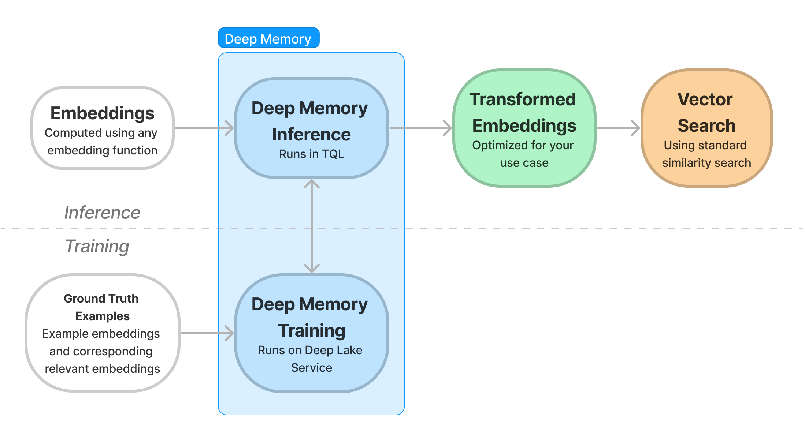

# How it Works

## How Deep Memory Works

Deep Memory computes transformation of your embeddings based on several examples of embeddings for which the most relevant embedding in the Vector Store is known. The transformation is computed computed on a Deep Lake Managed Service, and it is applied at inference in Deep Lake's Tensor Query Language (TQL).

<figure><figcaption></figcaption></figure>
