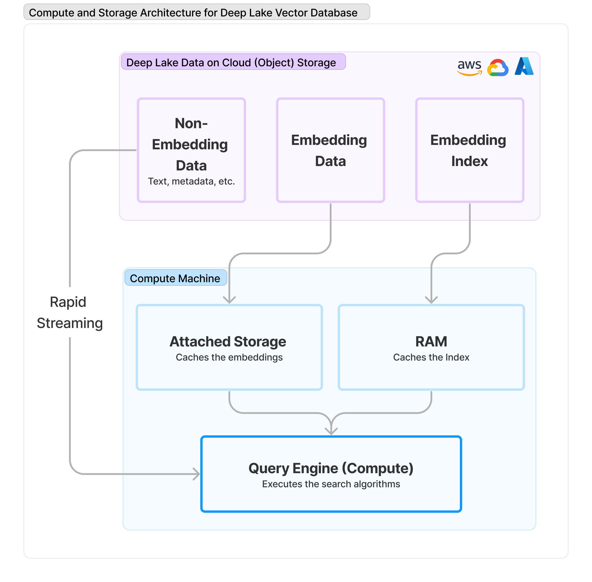

# Index for ANN Search

## How Deep Lake Implements an Index for ANN Search

Deep Lake implements the Hierarchical Navigable Small World (HSNW) index for Approximate Nearest Neighbor (ANN) search. The index is based on the [OSS Hsnwlib package](https://github.com/nmslib/hnswlib) with added optimizations. The implementation enables users to run queries on >35M embeddings in less than 1 second.

#### Unique aspects of Deep Lake's HSNW implementation

* Rapid index creation with multi-threading optimized for Deep Lake
* Efficient memory management that reduces RAM usage

#### Memory Management in Deep Lake

<mark style="color:green;">`RAM Cost  >>  On-disk Cost  >>  Object Storage Cost`</mark>

Minimizing RAM usage and maximizing object store significantly reduces costs of running a Vector Database. Deep Lake has a unique implementation of memory allocation that minimizes RAM requirement without any performance penalty:

<figure><figcaption><p>Memory Architecture for the Deep Lake Vector Store</p></figcaption></figure>

### Using the Index

By default, Deep Lake performs linear embedding search for up to 100,000 rows of data. Once the data exceeds that limit, the index is created and the embedding search uses ANN.  This index threshold is chosen because linear search is the most accurate, and for less than 100,000 rows, there is almost no performance penalty compared to ANN search.

You may update the threshold for creating the index using the API below:

```python
vectorstore = VectorStore(path, index_params = {threshold: <threshold_int>})
```

### Limitations

The following limitations of the index are being implemented in upcoming releases:

* If the search is performed using a combination of attribute and vector search, the index is not used and linear search is applied instead.
