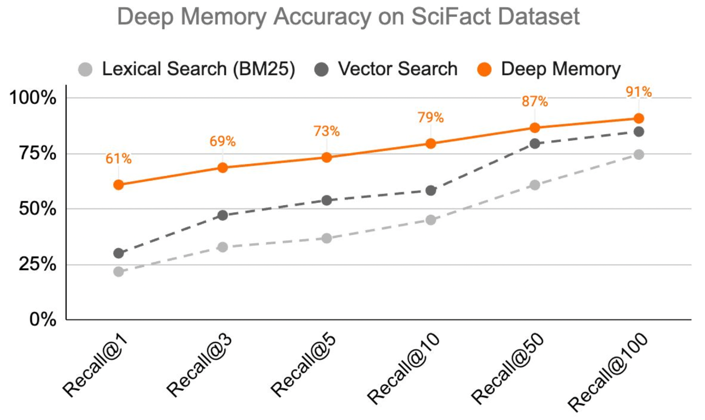

# Deep Memory

## How to Use Deep Memory to Improve Retrieval Accuracy in Your LLM Apps

Deep Memory is a suite of tools that enables you to optimize your Vector Store for your use-case and achieve higher accuracy in your LLM apps.

### Embedding Transformation

Deep Memory computes a transformation that converts your embeddings into an embedding space that is tailored for your use case. This increases the accuracy of your Vector Search by up to 22%, which significantly impacts the user experience of your LLM applications.&#x20;

Furthermore, Deep Memory can also be used to decrease costs by reducing the amount of context `(k)` that must be injected into the LLM prompt to achieve a given accuracy, thereby reducing token usage.

<figure><figcaption></figcaption></figure>
