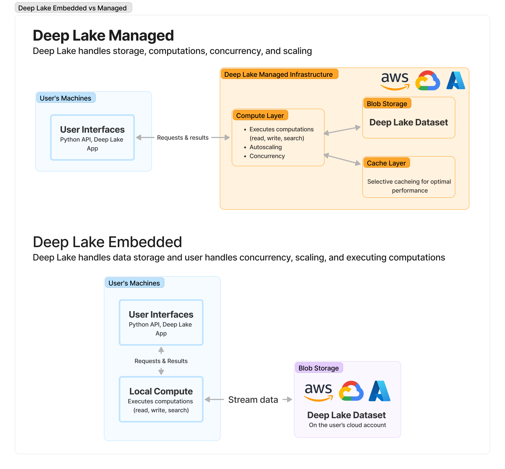

# Managed Tensor Database

## Overview of Deep Lake's Managed Tensor Database

Deep Lake offers a serverless Managed Tensor Database that eliminates the complexity of self-hosting and substantially lowers costs. Currently, it only supports dataset queries, including vector search, but additional features for creating and modifying data being added in December 2023.

<figure><figcaption>
Comparison of Deep Lake as a Managed Database vs Embedded Database
</figcaption></figure>

### User Interfaces

#### LangChain and LlamaIndex

To use the Managed Vector Database in LangChain or Llama Index, specify `dataset_path = hub://org_id/dataset_name` and `runtime = {"tensor_db": True}` during Vector Store creation.

#### REST API

A standalone REST API is available for interacting with the Managed Database:


[rest-api.md](rest-api.md)


### Further Information:


[migrating-datasets-to-the-tensor-database.md](migrating-datasets-to-the-tensor-database.md)

