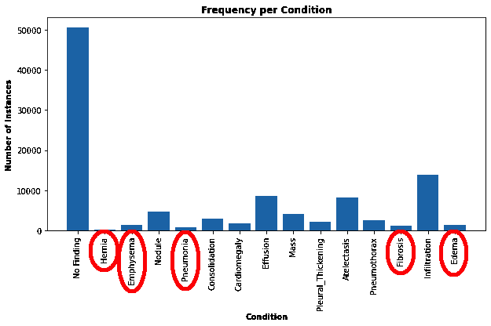
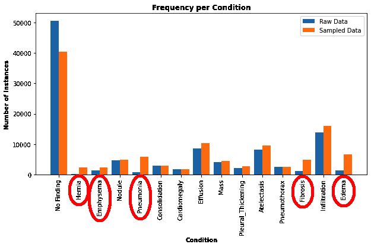

# Sampling Datasets

## How to sample datasets using Deep Lake's query engine

Sampling is often used when training models in order to modify the distribution of data that models are trained on. A common objective of samplers is to rebalance the data in order to achieve an more uniform distribution of classes in the training loop. Deep Lake provides a powerful API for several sampling methods via the query engine.&#x20;


Sampler queries in Deep Lake are only accessible to registered and authenticated users, and it applies usage restrictions based on your Deep Lake Plan.


**The general syntax for sampling is using the `sample by` keywords:**

```sql
select * sample by weight_choice(expression_1: weight_1, expression_2: weight_2, ...)
        replace True limit N
```

* **`weight_choice`** resolves the weight that is used when multiple expressions evaluate to `True` for a given sample. Options are `max_weight, sum_weight`. For example, if `weight_choice` is `max_weight`, then the maximum weight will be chosen for that sample.
* **`replace`** determines whether samples should be drawn with replacement. It defaults to `True`.
* **`limit`** specifies the number of samples that should be returned. If unspecified, the sampler will return the number of samples corresponding to the length of the dataset

Sampling can be performed in the query interface in the Deep Lake UI, or in the Python API as shown below.&#x20;

### Example Usage

Suppose we're working with a medical imaging dataset such as the [NIH Chest X-Ray](https://app.activeloop.ai/activeloop/nih-chest-xray-train). Let's use samplers to create a more balanced `view` of the dataset that we can use for training a model. First, let's load the dataset:

```python
import deeplake
import numpy as np
from matplotlib import pyplot as plt

ds = deeplake.load('hub://activeloop/nih-chest-xray-train')
```

Next, let's calculate the a histogram of the medical findings (`findings` tensor) and plot it.

```python
# Extract the list of class_names in a separate variable for re-use
class_names = ds.findings.info.class_names
num_classes = len(class_names)

class_count_raw = np.bincount(np.concatenate(ds.findings.numpy(aslist = True), axis=0))
```

```python
plt.bar(np.arange(num_classes), class_count_raw, tick_label = class_names)
plt.xlabel('Condition', weight='bold')
plt.xticks(rotation='vertical')
plt.ylabel('Number of Instances', weight='bold')
plt.title('Frequency per Condition', weight='bold')
plt.show()
```

<figure><figcaption></figcaption></figure>

We observe that findings such as `Hernia`, `Pneumonia`, `Fibrosis`, `Edema` , and `Emphysema` are very rare, which may cause our model to underperform when predicting these conditions. Note that even though many images have `No_Finding`, this is desirable for avoiding false positives when training models for medical imaging applications.

We can use Deep Lake Tensor-Query-Language to upsample the under-represented findings in order to create a more balanced dataset.

<pre class="language-sql"><code class="lang-sql"><strong>select * sample by max_weight(contains(findings, 'Hernia'): 20, 
</strong>                               contains(findings, 'Pneumonia'): 8, 
                               contains(findings, 'Fibrosis'): 5, 
                               contains(findings, 'Edema'): 5,
                               contains(findings, 'Emphysema'): 2, True: 1)
</code></pre>

We can run this query in the UI or in the Python API using `ds.query(...)`:

```
balanced_view = ds.query("select * sample by max_weight(contains(findings, 'Hernia'): 20, contains(findings, 'Pneumonia'): 8, contains(findings, 'Fibrosis'): 5, contains(findings, 'Edema'): 5, contains(findings, 'Emphysema'): 2, True: 1)")
```

In this sampler query, we're upsampling `Hernia`, by 20x, `Pneumonia` by 8x, `Fibrosis` by 5x, `Edema` by 5x, and `Emphysema` by 2x. Let's recalculate the histogram for the balanced dataset and compare it to the raw data histogram.&#x20;

```python
class_count_balanced = np.bincount(np.concatenate(balanced_view.findings.numpy(aslist = True), axis=0))
```

```python
X_axis = np.arange(len(class_names))

plt.figure(figsize=(8, 4))

plt.bar(X_axis - 0.2, class_count_raw, 0.4, label = 'Raw Data')
plt.bar(X_axis + 0.2, class_count_balanced, 0.4, label = 'Sampled Data')
  
plt.xticks(X_axis, class_names)
plt.xlabel('Condition', weight='bold')
plt.xticks(rotation='vertical')
plt.ylabel('Number of Instances', weight='bold')
plt.title('Frequency per Condition', weight='bold')
plt.legend()
plt.show()
```

<figure><figcaption></figcaption></figure>

The data in the upsampled dataset has much better representation of the rare conditions. Note that since a given image may have multiple conditions, and since conditions can be correlated, upsampling by one condition may implicitly upsample another condition, if they tend to occur in the same image.&#x20;

#### Training Models on Sampled Views

The sampled `dataset view` can be passed to a dataloader just like an ordinary Deep Lake dataset. Examples of dataset training [can be found in our training tutorials](../../tutorials/deep-learning/training-models/).

```python
pytorch_dataloader = balanced_view.pytorch(...)

for data in pytorch_dataloader:
    # Training loop
```

