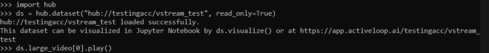

# Working with Videos

## How to manage video datasets and train models using Deep Lake.

Performing deep-learning on video data can be challenging due to the large size of video files, especially when they are uncompressed to raw numeric data that is fed into neural networks. Deep Lake abstracts these challenges away from the user so you can focus on building performant models.

### Setup


Make sure to install Deep Lake with `pip install "deeplake[av]"` in order to use Deep Lake's audio and video features.


```python
import deeplake
ds = deeplake.empty("demo/video") # create a local dataset
```

### Creating a video tensor

To create a video tensor, we specify an `htype` of "video" and set `sample_compression` to the format of the video.

```python
ds.create_tensor("videos", htype="video", sample_compression="mp4")
```

### Adding video samples

We append videos to the newly created tensor by reading the video files with `deeplake.read`

```python
ds.videos.append(deeplake.read("./videos/example1.mp4"))
ds.videos.append(deeplake.read("./videos/example2.mp4"))
```

`deeplake.read` can also read videos from `http://`, `gcs://` and `s3://` urls given you have the credentials to access them. Examples include:

```python
ds.videos.append(
    deeplake.read(
        "http://commondatastorage.googleapis.com/gtv-videos-bucket/sample/ForBiggerBlazes.mp4",
        creds=None,
    )
)
```

```python
ds.videos.append(
    deeplake.read(
        "s3://bucket-name/sample_video.mp4",
        creds={
            "aws_access_key_id": "...",
            "aws_secret_access_key": "...",
            "aws_session_token": "...",
        },
    )
)
```


See [deeplake`.read`](https://api-docs.activeloop.ai/#hub.read) and check out [this notebook](https://colab.research.google.com/drive/10UjDqQ4BiogSluTjF7nUkcfggk1sGi7K?usp=sharing) to see this in action.


### Adding annotations


See a complete example for this section in [this notebook](https://colab.research.google.com/drive/1z-KYuQWwiFb5Ye-BFm0dCKDbM-o7vsiT?usp=sharing).


Annotations like bounding boxes can be added and visualized in Deep Lake along with the video samples. We use tensors of htype `sequence[bbox]` for this purpose. Every sample in a `sequence[bbox]` tensor will be a sequence of bounding boxes which represents the annotations for the corresponding video sample in the `video` tensor.


Learn more about sequences [here](broken-reference).


```python
ds.create_tensor("boxes", htype="sequence[bbox]", coords={"type": "pixel", "mode": "LTWH"})
```


See [this page](broken-reference) for more details about the `bbox` htype.


Next, here's an example of an annotations file taken from the [LaSOT dataset](https://arxiv.org/abs/1809.07845). It contains annotations for every frame of a video.


Example of an annotations file


We convert this to a numpy array and append it to our `boxes` tensor.

```python
import pandas as pd
df = pd.read_csv("groundtruth.txt", header=None)
boxes = df.to_numpy().astype(np.float32)[:, np.newaxis]
# boxes.shape == (2788, 1, 4) == (number of frames, number of boxes, 4)
```

```python
ds.boxes.append(boxes)
```

Visualize the bounding boxes within your notebook using `ds.visualize()`.


The shapes of the samples in the `video` and `sequence[bbox]`tensors have to match in order for visualization to work properly.

If the shape of video tensor is `(# frames, height, width, 3)`, the shape of the sequence tensor should be`(# frames, # of boxes in a frame, 4)`



### Accessing video metadata

#### Shape

We can get the shape of a video sample in (N, H, W, C) format using

```python
ds.videos[0].shape
```

```python
(400, 360, 640, 3)
```

#### Sample info

Info about a video sample can be accessed using

```python
ds.videos[0].sample_info
```

This returns info about the first sample as a dict:

```python
{
    'duration': 400400,
    'fps': 29.97002997002997,
    'timebase': 3.3333333333333335e-05,
    'shape': [400, 360, 640, 3],
    'format': 'mp4',
    'filename': './videos/example1.mp4',
    'modified': False
}
```


`duration` is in units of`timebase`


### Accessing video frames

The most important part of working with videos on Deep Lake is retrieving the frames of a video sample as a numpy array.

```python
video = ds.videos[0].numpy()
```

This decompresses the entire first video sample and returns the frames as a numpy array.

```python
print(type(video))
print(video.shape)
```

```python
<class 'numpy.ndarray'>
(400, 360, 640, 3)
```


Be careful when decompressing an entire large video sample because it can blow up your memory.


Deep Lake allows you to index the video tensor like a numpy array and return the frames you want. _Only the required frames are decompressed._ See a few examples below_:_

**Getting a 100 frames from index 100 - 200**

```python
# 1st sample, frames 100 - 200
video = ds.videos[1, 100:200].numpy()
video.shape
```

```python
(100, 360, 640, 3)
```

**Indexing with step**

```python
# 0th sample, frames 100 - 200 with step of 5 frames
video = ds.videos[0, 100:200:5].numpy()
video.shape
```

```python
(20, 360, 640, 3)
```

**Getting a single frame**

```python
# 1st sample, last frame
last_frame = ds.videos[1, -1].numpy()
last_frame.shape
```

```python
(360, 640, 3)
```

### Accessing video timestamps

Presentation timestamps (PTS) of frames can be obtained (in seconds) through a video tensor's `.timestamp` attribute after indexing it just like in the previous section:

```python
# timestamps of frames 10 - 15 of 0th sample
ds.videos[0, 10:15].timestamp
```

```python
array([0.36703333, 0.4004    , 0.43376666, 0.46713334, 0.5005    ],
      dtype=float32)
```

#### `.data()`

Calling `ds.videos[index].data()` will return a dict with keys 'frames' and 'timestamps' with the corresponding numpy arrays as values. Indexing works the same way as it does with `.numpy()`.

```python
data = ds.videos[1, 15:20].data()
data['frames'].shape
data['timestamps']
```

```python
(5, 360, 640, 3)
array([0.5005    , 0.5672333 , 0.6006    , 0.6339667 , 0.76743335],
      dtype=float32)
```

### Visualizing videos

#### `.play()`

Individual video samples can be instantly visualized by calling `.play()` on them:

```python
ds.videos[1].play()
```

This will play the video on your web browser:




On a jupyter notebook this will look like:

.png>)


_This feature is not yet supported on colab_


#### `ds.visualize()`

The whole Deep Lake dataset can be visualized by calling `.visualize()` on your dataset in a jupyter or colab notebook.

```
ds.visualize()
```


Try this out for yourself [here](https://colab.research.google.com/drive/1xyhi31ZPLOcOIYAbjobfyn\_X2BgwKQeY?usp=sharing)!


On colab, we only support visualizing `hub://`datasets


### Linked videos

Tensors of Deep Lake type `link[video]` can be used to store links to videos. All of the above features are supported for linked videos. `https://`, `gcs://`, `s3://`and `gdrive://`links are accepted.

```python
# create linked tensor
links = ds.create_tensor("video_links", htype="link[video]")

# append linked samples
links.append(deeplake.link("http://commondatastorage.googleapis.com/gtv-videos-bucket/sample/ForBiggerBlazes.mp4", creds_key=None)) # link to public video

# .numpy()
video = links[0].numpy()

# shape of numpy array
video.shape
```

```python
(360, 720, 1280, 3)
```

You will need to set credentials to link to private data on your S3 or GCS.

#### For Activeloop cloud datasets

This proccess is easy and streamlined for `deeplake://` datasets.

* First, go to your [Activeloop platform](https://app.activeloop.ai), login and choose 'Managed credentials' in settings.
* And then choose 'Add Credentials'.
* Select a credentials provider, set the credentials name (say, 'MY\_KEY'), fill the fields and save it.
* Done! Your credentials have now been set.

#### Add managed credentials to your dataset

Use `ds.add_creds_key` with `managed` set to True to add the credentials to your dataset. Multiple credentials can be added.

```python
ds.add_creds_key("MY_KEY", managed=True)
ds.add_creds_key("S3_KEY", managed=True)
```

#### Use credentials

And when adding linked data using `deeplake.link`, simply mention which credentials to use through the `creds_key` argument.

```python
ds.links.append(deeplake.link("s3://my-bucket/sample-video.mp4", creds_key="MY_KEY"))
```

#### For non Activeloop cloud datasets

For non-`hub://` datasets, you can use credentials set in your environment by mentioning `creds_key="ENV"`

```python
ds.links.append(deeplake.link("s3://my-bucket/sample-video.mp4", creds_key="ENV"))
```

Or you can temporarily add creds to your dataset

```python
creds={
        "aws_access_key_id": "...",
        "aws_secret_access_key": "...",
        "aws_session_token": "...",
    }

# add creds key (Note that managed is False)
ds.add_creds_key("TEMP_KEY")

# populate creds with a credentials dict
ds.populate_creds("TEMP_KEY", creds)
```

and then

```python
ds.links.append(deeplake.link("s3://my-bucket/sample-video.mp4", creds_key="TEMP_KEY"))
```


See [deeplake`.link`](https://api-docs.activeloop.ai/#hub.link)


### Video streaming


This section describes some implementation details regarding how video data is fetched and decompressed in Deep Lake.


Large video samples (> 16MB by default) stored in remote Deep Lake datasets are not downloaded in their entirety on calling `.numpy()`. Instead, they are streamed from storage. Only the required packets are decompressed and converted to numpy arrays based on how the tensor is indexed.

`.play()`also streams videos from storage.
