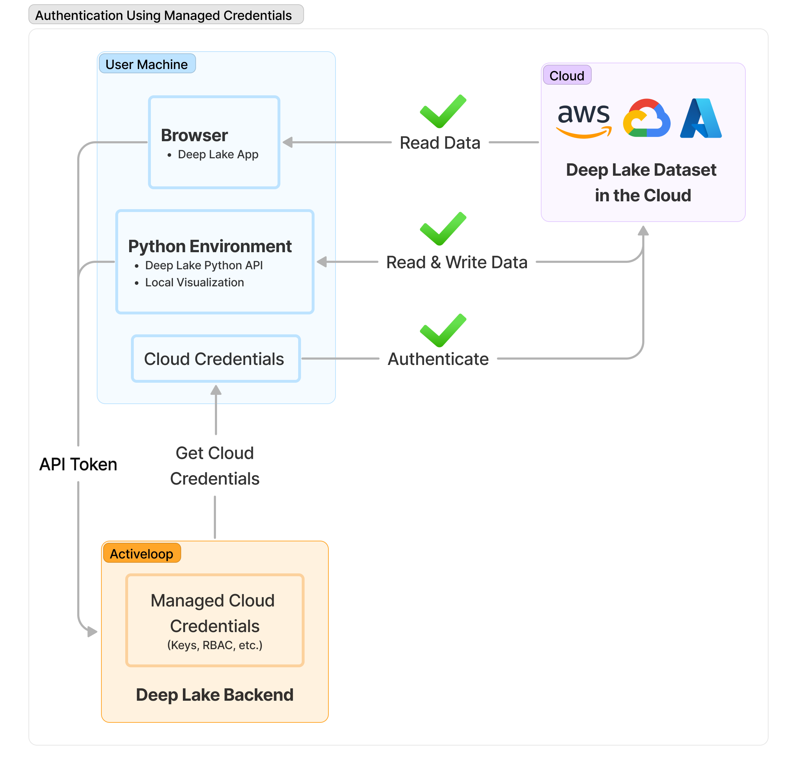

# Setting up Deep Lake in Your Cloud

## Connecting Data From Your Cloud Using Deep Lake Managed Credentials

Connecting data from your own cloud and managing credentials in Deep Lake unlocks several important capabilities:

* Access to performant features such as the [Deep Lake Compute Engine](broken-reference)
* Access to the [Deep Lake App](https://app.activeloop.ai/) for datasets stored in your own cloud
* Simpler access to Deep Lake datasets stored in your own cloud using the Python API
  * No need for continuously specifying cloud access keys in Python

### Managed Credentials

In order for the Deep Lake to access datasets or linked tensors stored in the user's cloud, Deep Lake must authenticate the respective cloud resources. Access can be provided using access keys or using role-based access ([provisioning steps here](amazon-web-services/provisioning-rbac.md)). The video below summarizes the UI for managing your cloud credentials.&#x20;



<figure><figcaption><p>Authentication Using Managed Credentials</p></figcaption></figure>

### Default Storage

Default storage enables you to map the Deep Lake path `hub://org_id/dataset_name`to a cloud path of your choice. Subsequently, all datasets created using the Deep Lake path will be stored at the user-specified specified, and they can be accessed using API tokens and managed credentials from Deep Lake. By default, the default storage is set as Activeloop Storage, and you may change it using the UI below.




Note: that in order to visualize data in the Deep Lake browser application, it is necessary to [enable CORS](amazon-web-services/enabling-cors.md) in the bucket containing any source data.


### Connecting Deep Lake Dataset in your Cloud to the Deep Lake to App

If you do not set the Default Storage as your own cloud, Datasets in user's clouds can be connected to the [Deep Lake App](https://app.activeloop.ai/) using the Python API below. Once a dataset is connected to Deep Lake, it is assigned a Deep Lake path `hub://org_id/dataset_name`, and it can be accessed using API tokens and managed credentials from Deep Lake, without continuously having to specify cloud credentials.

#### **Connecting Datasets in the Python API**

<pre class="language-python"><code class="lang-python"># Step 1: Create/load the dataset directly in the cloud using your org_id and
# Managed Credentials (creds_key) for accessing the data (See Managed Credentials above)
ds = deeplake.empty/load('s3://my_bucket/dataset_name', 
                    creds={'creds_key': 'managed_creds_key'}, org_id='my_org_id')

# Step 2a: Connect the dataset to Deep Lake, inheriting the dataset_name above
ds.connect()
## ->>> This produces a Deep Lake path for accessing the dataset such as:
## ---- 'hub://my_org_id/dataset_name'

<strong>## OR
</strong>
# Step 2b: Specify your own path and dataset name for future access to the dataset.
# You can also specify different managed credentials, if desired
ds.connect(dest_path = 'hub://org_id/dataset_name', creds_key = 'my_creds_key')
</code></pre>

### Using Manage Credentials with Linked Tensors

Managed credentials can be used for accessing data stored in [linked tensors](https://docs.deeplake.ai/en/latest/Htypes.html#link-htype). Simply add the managed credentials to the dataset's `creds_keys` and assign them to each sample.

```python
ds.create_tensors('images', htype = 'link[image]', sample_compression = 'jpeg')

ds.add_creds_key('my_creds_key', managed=True)

ds.images.append(deeplake.link(link_to_sample, creds_key = 'my_creds_key')
```

