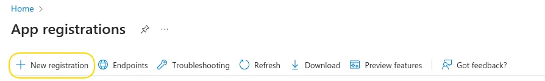

# Configure Azure SSO on Activeloop

### Configure Azure SSO on Activeloop

### 1. Creating Application

* **Go to App registration page in** [**🌐Azure portal**](https://portal.azure.com/#view/Microsoft\_AAD\_RegisteredApps/ApplicationsListBlade)
* **Click on add New Registration**

<figure><figcaption></figcaption></figure>

1. Put name for the application
2. For application type, select `Default Directory only - Single tenant`
3. For Redirect URI select the type `Web`
4. For Callback URL put `https://auth.activeloop.ai/login/callback`
5. Click on `Register`

<figure><figcaption></figcaption></figure>

#### Once it is created go to `Overview` page, copy and send us the `Application (client) ID` and the `Directory (tenant) ID`

<figure><figcaption></figcaption></figure>

#### Client secret creation

Go to `Certificates & Secrets` → `Client secrets` →`New client secret`

Name the secret, select preferred expiration and click `Add`

`NOTE: The secret need to be updated before it get expired`

<figure><figcaption></figcaption></figure>

#### Send us the secret value

<figure><figcaption></figcaption></figure>

### 2. Granting Permissions

1. **Go to `API permissions` → `Microsoft Graph` → `Delegated Permissions` and select following permissions:**
   1. `email`
   2. `openid`
   3. `profile`

<figure><figcaption></figcaption></figure>

<figure><figcaption></figcaption></figure>

<figure><figcaption></figcaption></figure>

2. **In the search bar search `Directory.Read.All` and select the permission as well**

<figure><figcaption></figcaption></figure>

#### Click on `Add permissions`

<figure><figcaption></figcaption></figure>

### 3. Domain Name Validation in our side

We also will be needing domain of the azure tenant to authorize the SSO clients

1. Go to [🌐Domain Names](https://portal.azure.com/#view/Microsoft\_AAD\_IAM/DomainsList.ReactView) in Azure portal
2. Copy the domain name that will be used for SSO and send us

<figure><figcaption></figcaption></figure>
