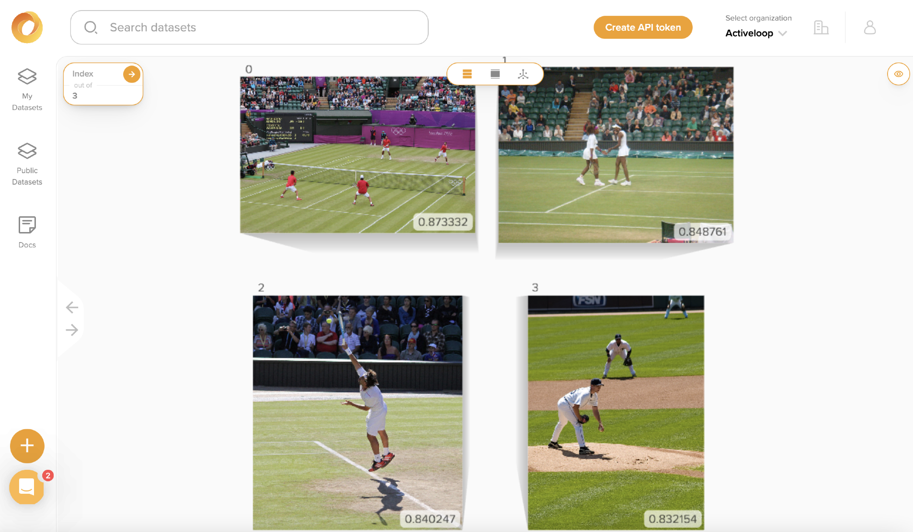

# Image Similarity Search

## How to Use Deep Lake as a Vector Store for Images

Deep Lake is a unique Vector Store because it supports storage of various data types including images, video, and audio. In this tutorial we show how to use Deep Lake to perform similarity search for images.&#x20;

### Creating the Vector Store

We will use \~5k images in the [COCO Validation Dataset](https://cocodataset.org/#home) as a source of diverse images. First, let's download the data.

```python
!wget -O "<download_path>" http://images.cocodataset.org/zips/val2017.zip
# MAC !curl -o "<download_path>" http://images.cocodataset.org/zips/val2017.zip
```

We must unzip the images and specify their parent folder below.

```python
images_path = <download_path>
```

Next, let's define a [ResNet18 PyTorch model](https://pytorch.org/vision/main/models/resnet.html) to embed the images based on the output from the second-to-last layer. We use the `torchvision` feature extractor to return the output of the `avgpool` layer to the `embedding` key, and we run on a GPU if available. (Note: `DeepLakeVectorStore` class was deprecated, but you can still use it. The new API for calling Deep Lake's Vector Store is: `VectorStore.`)

```python
from deeplake.core.vectorstore.deeplake_vectorstore import VectorStore
import os
import torch
from torchvision import transforms, models
from torchvision.models.feature_extraction import create_feature_extractor
from PIL import Image

device = torch.device('cuda') if torch.cuda.is_available() else torch.device('cpu')
```

```python
model = models.resnet18(pretrained=True)

return_nodes = {
    'avgpool': 'embedding'
}
model = create_feature_extractor(model, return_nodes=return_nodes)

model.eval()
model.to(device)
```

Let's define an embedding function that will embed a list of image filenames and return a list of embeddings. A transformation must be applied to the images so they can be fed into the model, including handling of grayscale images.

```python
tform= transforms.Compose([
    transforms.Resize((224,224)), 
    transforms.ToTensor(),
    transforms.Lambda(lambda x: torch.cat([x, x, x], dim=0) if x.shape[0] == 1 else x),
    transforms.Normalize([0.485, 0.456, 0.406], [0.229, 0.224, 0.225]),
])

def embedding_function(images, model = model, transform = tform, batch_size = 4):
    """Creates a list of embeddings based on a list of image filenames. Images are processed in batches."""

    if isinstance(images, str):
        images = [images]

    #Proceess the embeddings in batches, but return everything as a single list
    embeddings = []
    for i in range(0, len(images), batch_size):
        batch = torch.stack([transform(Image.open(item)) for item in images[i:i+batch_size]])
        batch = batch.to(device)
        with torch.no_grad():
            embeddings+= model(batch)['embedding'][:,:,0,0].cpu().numpy().tolist()

    return embeddings
```

Now we can create the vector store for storing the data. The Vector Store does not have the default configuration with `text`, `embedding`, and `metadata` tensors, so we use the `tensor_params` input to define the structure of the Vector Store.&#x20;

```python
vector_store_path = 'hub://<org_id>/<dataset_name>'

vector_store = VectorStore(
    path = vector_store_path,
    tensor_params = [{'name': 'image', 'htype': 'image', 'sample_compression': 'jpg'}, 
                     {'name': 'embedding', 'htype': 'embedding'}, 
                     {'name': 'filename', 'htype': 'text'}],
)
```

Finally, we can create a list of images from the source data and add it to the vector store.&#x20;

```python
image_fns = [os.path.join(images_path, item) for item in os.listdir(images_path) if os.path.splitext(item)[-1]=='.jpg']
```

```python
vector_store.add(image = image_fns,
                 filename = image_fns,
                 embedding_function = embedding_function, 
                 embedding_data = image_fns)
```

We observe in the automatically printed summary that the Vector Store has tensors for the `image`, their `filename`, their `embedding`, and an `id`, with 5000 samples each. This summary is also available via `vector_store.summary()`.

```
  tensor      htype                shape               dtype  compression
  -------    -------              -------             -------  ------- 
 embedding  embedding           (5000, 512)           float32   None   
 filename     text               (5000, 1)              str     None   
    id        text               (5000, 1)              str     None   
   image      image    (5000, 145:640, 200:640, 1:3)   uint8    jpeg   
```

### Similarity Search

Let's perform a similarity search on a reference image to find similar images in our Vector Store. First we download the image:

<figure><figcaption></figcaption></figure>



The similarity search will return data for the top k (defaults to 4) similar samples, including numpy arrays for the underlying images.

<pre class="language-python"><code class="lang-python">image_path = '/image_similarity.jpg'
<strong>
</strong><strong>result = vector_store.search(embedding_data = image_path, 
</strong>                             embedding_function = embedding_function)
</code></pre>

The key-value pairs in the result contains the tensor as the key and a list of values for the data:

```python
result.keys() 

# Returns: dict_keys(['filename', 'id', 'image', 'score'])
```

```python
len(result['score']) 

# Returns: 4
```

<pre class="language-python"><code class="lang-python"><strong>result['image'][0].shape
</strong><strong>
</strong># Returns: (427, 640, 3)
</code></pre>

Since images can be quite large, and we may not want to return them as numpy arrays, so we use `return_tensors` to specify that only the `filename` and `id` tensors should be returned:

```python
result = vector_store.search(embedding_data = image_path, 
                             embedding_function = embedding_function,
                             return_tensors = ['id', 'filename'])
```

```python
result.keys() 

# Returns: dict_keys(['filename', 'id', 'image', 'score'])
```

### Visualizing the Similarity Results

Instead of returning the results of the similarity search directly, we can use `return_view = True` to get the Deep Lake dataset view, which is a lazy pointer to the underlying data that satisfies the similarity search (no data is retrieved locally).

```python
view = vector_store.search(embedding_data = image_path, 
                             embedding_function = embedding_function, 
                             return_view = True)
```

We can then save the view and visualize it in the Deep Lake UI:

```python
view.save_view()
```

<figure><figcaption></figcaption></figure>

The images are all fairly similar to the reference image, so it looks like the similarity search worked well!

Congrats! You just used the Deep Lake VectorStore in for image similarity search! 🎉
